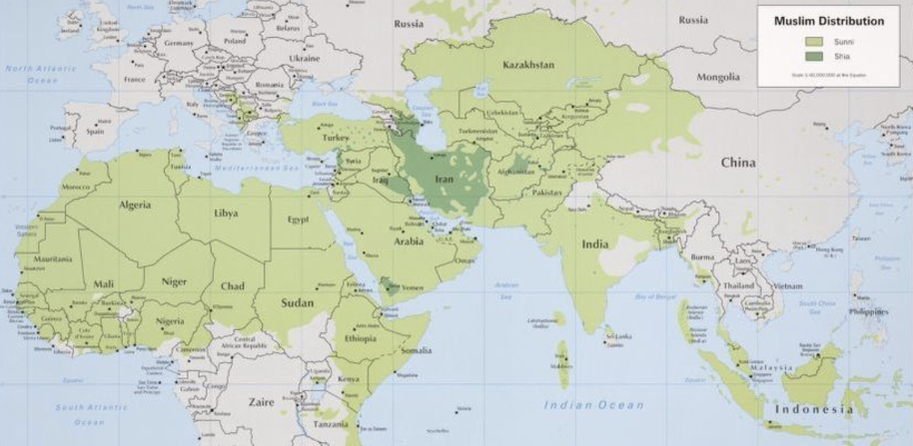

## Q-BLOCK | 401 - TRUST TERRITORIES OF AL HEJAZ

| 1 | Trust Territories of Al Hejaz | 2022 estimate |
|---|---|---|
| 2 | Economy |  ***31 Trillion***˹Dollars*˺  |
| 3 | Population |  1,999,987,500  |

##
| Charter | [US Madinah Mission 2020](https://github.com/Alghuti-Portfolio/QBlock_401/blob/b1ea5a0b9795e8bc39053fba83e722d9cab6c927/2020_HomeCharter5047.pdf) ("***UMM***") |       
|---|---|

##

### OVERVIEW 
We are looking for volunteer International Service Officers to serve as a liaison at one of any of the more than 270 embassies, consulates and other diplomatic missions throughout the United States. These missions include countries of the Americas, Africa, Europe and Eurasia, East Asia and Pacific, Middle East and North Africa, and South Asia. The work you’ll do will have an impact on the world!

The ***First Phase*** of roll out schedule will include the Development of Record Keeping Systems for Marriage Certificates, Property Deeds, and other Documents for the [US Faith Community](https://github.com/Alghuti-Portfolio/Q-Block_401/blob/41e39609b07e5ddc5f29a114ffac4268c29ad5c4/Files/1080_CallList.csv)

##

### 2. ECONOMY 
##

### 3. POPULATION 
##

### ASIA PACIFIC 
---
### EURASIA

---
### AFRICA 
##

### East Africa Region - 2010 to 2020 Census (Est.)
|Country| Pop. 2010 | %  | Members**| APGR% | Pop. 2020 | Members**|
|:---|:---:|:--- |:---:|:---:|:---:|:---:|
| Burundi | 9,282,811  | 1.58  | 146,668 |3.279 | 12,817,394 | 202,515 |
| Djibouti  | 525,876 | 99.00 |  520,617 |  1.903 | 634,970  | 628,620 |
| Eritrea  | 5,792,696 | 50.00 |  2,896,348 |  2.577  | 7,471,033 | 3,735,517 |
| Ethiopia  | 87,971,752 | 33.88  |  29,804,830 |  3.208 | 120,635,982  | 40,871,471 |
| Kenya  | 40,052,337 | 10.00  |  4,005,234 |  2.691 | 52,233,808  | 5,223,381 |
| Rwanda | 10,764,649   |   1.82 |  195,917 | 2.782 |  14,163,498 |  257,776 |
| Seychelles  |  88,350 |  1.06 |   937 | 0.999   |   97,584 |  1,034 |
| Somalia  | 10,108,788  | 99.99  |   10,107,777 | 2.815    |  13,343,320 |  13,341,985 |
| Tanzania  |  41,885,922 | 35.00 |    14,660,073 |   2.040 |   51,259,289 |   17,940,751 |  
| Uganda  |  33,240,947 |  12.10 |   4,022,155 |   2.692 |   43,355,032 |  5,245,959 |
 

 Credit - Houssain Kettani - University of South Carolina Aiken 

### South Africa Region - 2010 to 2020 Census (Est.)
|Country| Pop. 2010 | %  | Member**  | APGR% | Pop. 2020  | Members** |
|:---|:---:|:--- |:---:|:---:|:---:|:---:|
| Angola | 13,067,438   |   0.56 |  73,178 | 2.095 |  16,078,117 |  90,037 |
| Botswana  |  2,029,439 |  0.42 |   8,524 | 1.937   |   2,458,637 |  10,326 |
| Comoros  | 773,250  |   99.00 | 765,518  | 2.766     | 1,015,815   | 1,005,656   |
| Lesotho  |   2,133,291 | 0.05  |     1,067 |    0.116 |    2,158,167 |    1,079 |  
| Madagascar  | 21,273,163  | 10.00  |  2,127,316 | 3.00  | 28,589,352  | 2,858,935   |
| Malawi  |   14,609,448 |    12.82 |    1,871,470 |2.388    |    18,497,984 | 2,369,592   |
| Mayotte  | 231,187   |97   | 224,251    |3.317    | 320,392    | 310,780   |
| Mauritius  |   1,294,230 | 16.65   | 215,489    |0.776    |    1,398,243 |   232,807 |
| Mozambique  |   22,057,375 |   17.65 | 3,893,127    |    1.791 | 26,341,933    |   4,649,351 |
| Namibia  |   2,128,697 |   1.00 | 21,287    | 095    |    2,339,791 |   23,398 |
| South Africa  | 49,190,326   |   1.46 |    718,179 |    0.281 |    50,590,184 |   738,617 |
| Swaziland  |   1,118,754 |   10.00 |    111,875 |    -0.459 |    1,068,451 |   106,845 |
| Zambia |   12,056,221  |   1.00 |  120,562 | 1.631    |    14,173,372 |   141,734 |
| Zimbabwe  | 11,566,936   | 1.00   | 115,669    | 1.530    | 13,463,631    | 134,636   |

### Central Africa Region - 2010 to 2020 Census (Est.)

|Country| Population | %  | HJZ- Census | APGR% | Population  | HJZ - Census |
|:---|:---:|:--- |:---:|:---:|:---:|:---:|
| |   |   |  | |  |  |
|  |  |  |   |   |   |  |
|  |  |  |   |    |  |  |
|  |  |   |   |   |   |  |
|  |  |   |   |   |   |  |

### West Africa Region - 2010 to 2020 Census (Est.)

|Country| Population | %  | HJZ- Census | APGR% | Population  | HJZ - Census |
|:---|:---:|:--- |:---:|:---:|:---:|:---:|
| |   |   |  | |  |  |
|  |  |  |   |   |   |  |
|  |  |  |   |    |  |  |
|  |  |   |   |   |   |  |
|  |  |   |   |   |   |  |

### North Africa Region - 2010 to 2020 Census (Est.)

|Country| Population | %  | HJZ- Census | APGR% | Population  | HJZ - Census |
|:---|:---:|:--- |:---:|:---:|:---:|:---:|
| |   |   |  | |  |  |
|  |  |  |   |   |   |  |
|  |  |  |   |    |  |  |
|  |  |   |   |   |   |  |
|  |  |   |   |   |   |  |

---
### WEST ASIA (MIDDLE EAST)
---
### EUROPE
