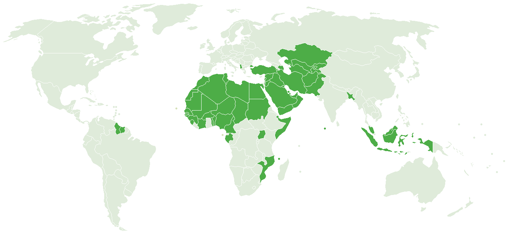
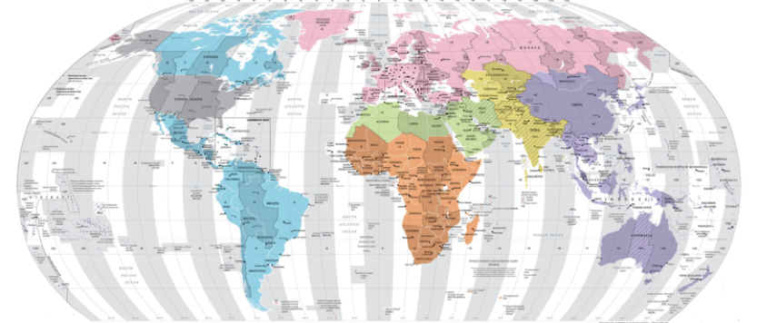
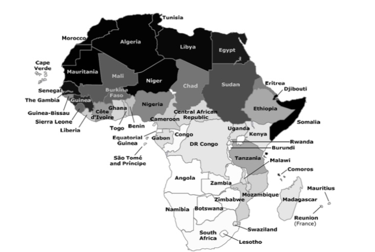

## Q-BLOCK | 401 - TRUST TERRITORIES OF AL HEJAZ

 It is anticipated the U.S. Madinah Mission will maintain “interest sections” (in other states' embassies including other associated states') in [associated member states](2020_HomeCharter5047.pdf).  Interests sections and other representations (green). 

##

| 1 | Trust Territories of Al Hejaz | 2022 estimate |
|---|---|---|
| 2 | Economy |  ***31 Trillion***˹Dollars*˺  |
| 3 | Population |  1,999,987,500  |

| Charter | [US Madinah Mission 2020](https://github.com/Alghuti-Portfolio/QBlock_401/blob/b1ea5a0b9795e8bc39053fba83e722d9cab6c927/2020_HomeCharter5047.pdf) ("***UMM***") |       
|---|---|

##

## OVERVIEW 
The US Madinah Mission will solicit invitations to prospect liaison officer's (volunteer International Service Officers) to reach out to any of the more than 270 embassies, consulates and other diplomatic missions throughout the United States. These missions include countries of the Americas, Africa, Europe and Eurasia, East Asia and Pacific, Middle East and North Africa, and South Asia. The work you’ll do will have an impact on the world!

The mission of a liaison officer (ambassador of the UMM) in the International Service is to promote peace, support prosperity, and protect both American and Islamic interests and peoples while advancing the [U.S. Madinah Mission](https://drive.google.com/file/d/1V5uLrfEJb1OdnjQHw21S0uyz3bNvxpny/view?usp=drivesdk).

If you’re passionate about public service and want to represent the American Islamic Mission around the world, a challenging and rewarding opportunity is waiting for you. While travel is not required, the opportunity to connect with your ancestral origins, experience cultures, customs and people of different nations is truly an opportunity unlike any other.

Start by exploring the work break down assignments for a successful roll out, and identify which tasks may be achieved with your particular skill set and capabilities. The ***First Phase*** of the roll out schedule will include the Development of Record Keeping Systems for Marriage Certificates, Property Deeds, and other Documents for the [US Faith Community](Files/1080_CallList.csv). ***It is anticipated that the schedule will be published by mid-August 2022, and will provide instructions on how to become a part of this truly revolutionary transition.***

___
## 2. ECONOMY 

## 3. POPULATION 

---

### ASIA PACIFIC 
##
### EURASIA

##
### WEST ASIA (MIDDLE EAST)
##
### EUROPE

##
### AFRICA 
##

### East Africa Region - 2010 to 2020 Census (Est.)
|Country| Pop. 2010 | %  | Members**| APGR% | Pop. 2020 | Members**|
|:---|:---:|:--- |:---:|:---:|:---:|:---:|
| Burundi | 9,282,811  | 1.58  | 146,668 |3.279 | 12,817,394 | 202,515 |
| Djibouti  | 525,876 | 99.00 |  520,617 |  1.903 | 634,970  | 628,620 |
| Eritrea  | 5,792,696 | 50.00 |  2,896,348 |  2.577  | 7,471,033 | 3,735,517 |
| Ethiopia  | 87,971,752 | 33.88  |  29,804,830 |  3.208 | 120,635,982  | 40,871,471 |
| Kenya  | 40,052,337 | 10.00  |  4,005,234 |  2.691 | 52,233,808  | 5,223,381 |
| Rwanda | 10,764,649   |   1.82 |  195,917 | 2.782 |  14,163,498 |  257,776 |
| Seychelles  |  88,350 |  1.06 |   937 | 0.999   |   97,584 |  1,034 |
| Somalia  | 10,108,788  | 99.99  |   10,107,777 | 2.815    |  13,343,320 |  13,341,985 |
| Tanzania  |  41,885,922 | 35.00 |    14,660,073 |   2.040 |   51,259,289 |   17,940,751 |  
| Uganda  |  33,240,947 |  12.10 |   4,022,155 |   2.692 |   43,355,032 |  5,245,959 |
 

 Credit - Houssain Kettani - University of South Carolina Aiken 

### South Africa Region - 2010 to 2020 Census (Est.)
|Country| Pop. 2010 | %  | Member**  | APGR% | Pop. 2020  | Members** |
|:---|:---:|:--- |:---:|:---:|:---:|:---:|
| Angola | 13,067,438   |   0.56 |  73,178 | 2.095 |  16,078,117 |  90,037 |
| Botswana  |  2,029,439 |  0.42 |   8,524 | 1.937   |   2,458,637 |  10,326 |
| Comoros  | 773,250  |   99.00 | 765,518  | 2.766     | 1,015,815   | 1,005,656   |
| Lesotho  |   2,133,291 | 0.05  |     1,067 |    0.116 |    2,158,167 |    1,079 |  
| Madagascar  | 21,273,163  | 10.00  |  2,127,316 | 3.00  | 28,589,352  | 2,858,935   |
| Malawi  |   14,609,448 |    12.82 |    1,871,470 |2.388    |    18,497,984 | 2,369,592   |
| Mayotte  | 231,187   |97   | 224,251    |3.317    | 320,392    | 310,780   |
| Mauritius  |   1,294,230 | 16.65   | 215,489    |0.776    |    1,398,243 |   232,807 |
| Mozambique  |   22,057,375 |   17.65 | 3,893,127    |    1.791 | 26,341,933    |   4,649,351 |
| Namibia  |   2,128,697 |   1.00 | 21,287    | 095    |    2,339,791 |   23,398 |
| South Africa  | 49,190,326   |   1.46 |    718,179 |    0.281 |    50,590,184 |   738,617 |
| Swaziland  |   1,118,754 |   10.00 |    111,875 |    -0.459 |    1,068,451 |   106,845 |
| Zambia |   12,056,221  |   1.00 |  120,562 | 1.631    |    14,173,372 |   141,734 |
| Zimbabwe  | 11,566,936   | 1.00   | 115,669    | 1.530    | 13,463,631    | 134,636   |

##
### Central Africa Region - 2010 to 2020 Census (Est.)

##

### West Africa Region - 2010 to 2020 Census (Est.)
##

### North Africa Region - 2010 to 2020 Census (Est.)

## FAQ 

***Q : Does [H.R. 5665](https://www.congress.gov/117/bills/hr5665/BILLS-117hr5665rfs.pdf) serve a similar purpose as the US Madinah Mission?***

***A :*** Please click this [link](https://drive.google.com/file/d/1O2XvDtAFoumZ_opt9QvsUlZWOj7TgQnR/view?usp=drivesdk) and read the memo which provides insight into the tactics used by the US government against the Islamic community domestically and abroad, and the violations and atrocities committed at the hands of the U.S. Government and its allies (the original memo was sent on Sep 2018). To give an "islamic appearance" to the above bill introduced by Rep Omar and later past by Congress is a repeat of the tactics and crimes conveyed in the memo. The crimes committed against Islamic communities both domestically and internationally has stained the United States Government for the remainder of its history. The sanctions imposed [herein](https://github.com/Alghuti-Portfolio/Q-Block_401/blob/64e0a7a26cd00b6b6144653d6c94084e7ad4a593/Files/Redacted_Version%20_Sanctions.pdf) is in response to yet another crime the United States Government has engaged in, while attempting to conceal or legitimatize their crimes by passing a number of ["Executive Orders"](https://trumpwhitehouse.archives.gov/presidential-actions/executive-order-securing-information-communications-technology-services-supply-chain/) introduced by various "interests", and signed by incompetent presidents. It is clear the US Government does not play a positive role in the affairs of the Islamic community, nor will it be considered as a legitimate source of any good will. No rational person anticipates any positive development coming from the U.S. Government for Islam, its faithful adherents, for its own citizens (Islamic or not) or for any nation or group of nations. The Government of the United States has been corrupted absolutely, and has made its position known through its acts, and the acts of its so called "allies", a group Criminal degenerates who have seized power, and now spreading their tyranny and corruption throughout the world... the damage is beyond repair.
